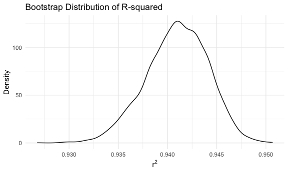
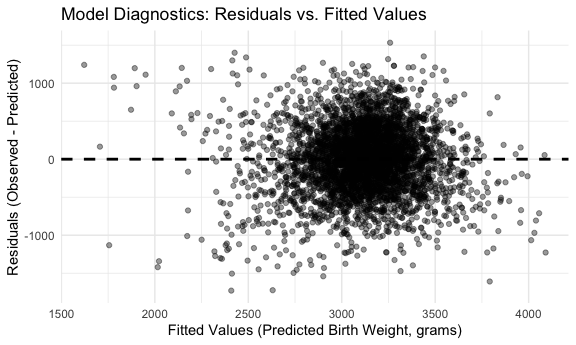

p8105_hw6_ml5218
================
Muying Li
2025-11-26

# Environment Setup

Load necessary packages, set plot theme, set seed

``` r
library(tidyverse)
```

    ## ── Attaching core tidyverse packages ──────────────────────── tidyverse 2.0.0 ──
    ## ✔ dplyr     1.1.4     ✔ readr     2.1.5
    ## ✔ forcats   1.0.0     ✔ stringr   1.5.1
    ## ✔ ggplot2   3.5.2     ✔ tibble    3.3.0
    ## ✔ lubridate 1.9.4     ✔ tidyr     1.3.1
    ## ✔ purrr     1.1.0     
    ## ── Conflicts ────────────────────────────────────────── tidyverse_conflicts() ──
    ## ✖ dplyr::filter() masks stats::filter()
    ## ✖ dplyr::lag()    masks stats::lag()
    ## ℹ Use the conflicted package (<http://conflicted.r-lib.org/>) to force all conflicts to become errors

``` r
library(modelr)
library(mgcv)
```

    ## Loading required package: nlme
    ## 
    ## Attaching package: 'nlme'
    ## 
    ## The following object is masked from 'package:dplyr':
    ## 
    ##     collapse
    ## 
    ## This is mgcv 1.9-3. For overview type 'help("mgcv-package")'.

``` r
set.seed(1)
library(patchwork)
#library(dplyr)
# library(rvest)
knitr::opts_chunk$set(
  fig.path = "figs/",
  fig.width = 6,
  fig.asp = .6,
  out.width = "90%"
)

theme_set(theme_minimal() + theme(legend.position = "bottom"))

options(
  ggplot2.continuous.colour = "viridis",
  ggplot2.continuous.fill = "viridis"
)

scale_colour_discrete = scale_colour_viridis_d
scale_fill_discrete = scale_fill_viridis_d
```

# Problem 1

Tidy the raw data

``` r
# load data and clean names
homicide_data = read_csv("data/homicide-data.csv") |>
  janitor::clean_names() |> 
  mutate(
    # create a city_state variable (e.g. “Baltimore, MD”) 
    city_state = paste(str_trim(city), str_trim(state), sep = ", "),
    # and a binary variable indicating whether the homicide is solved = closed by arrest (1), otherwise (0)
    status = ifelse(disposition == "Closed by arrest", 1, 0),
    # convert victim_age as numeric
    # noted NA introduced by coercion
    victim_age = as.numeric(victim_age)
  ) |>
  # omit Dallas, TX; Phoenix, AZ; Kansas City, MO; Tulsa, AL 
  filter(
    !city_state %in% c(
      "Dallas, TX",
      "Phoenix, AZ",
      "Kansas City, MO",
      "Tulsa, AL"
    )
  ) |> 
  # limit analysis those for whom victim_race is white or black
  filter(
    victim_race %in% c("White", "Black")
  )
```

    ## Rows: 52179 Columns: 12
    ## ── Column specification ────────────────────────────────────────────────────────
    ## Delimiter: ","
    ## chr (9): uid, victim_last, victim_first, victim_race, victim_age, victim_sex...
    ## dbl (3): reported_date, lat, lon
    ## 
    ## ℹ Use `spec()` to retrieve the full column specification for this data.
    ## ℹ Specify the column types or set `show_col_types = FALSE` to quiet this message.

    ## Warning: There was 1 warning in `mutate()`.
    ## ℹ In argument: `victim_age = as.numeric(victim_age)`.
    ## Caused by warning:
    ## ! NAs introduced by coercion

Take a quick look on the data

``` r
homicide_data |> 
  count(victim_sex, victim_race)
```

    ## # A tibble: 6 × 3
    ##   victim_sex victim_race     n
    ##   <chr>      <chr>       <int>
    ## 1 Female     Black        4066
    ## 2 Female     White        1837
    ## 3 Male       Black       29256
    ## 4 Male       White        4493
    ## 5 Unknown    Black          39
    ## 6 Unknown    White           2

Noted `victim_sex` has unknown values. Remove it.

``` r
homicide_data = homicide_data |> 
  filter(
    victim_sex != "Unknown"
  )
```

Take a quick look on the data again to ensure the quality

``` r
homicide_data |> 
  count(victim_sex, victim_race)
```

    ## # A tibble: 4 × 3
    ##   victim_sex victim_race     n
    ##   <chr>      <chr>       <int>
    ## 1 Female     Black        4066
    ## 2 Female     White        1837
    ## 3 Male       Black       29256
    ## 4 Male       White        4493

## Fit a logistic regression for the city of Baltimore, MD using the `glm`

``` r
# save the output of `glm` as an R object
baltimore_glm_results = 
  homicide_data |> 
  filter(
    city_state == "Baltimore, MD"
  ) |> 
  # glm will auto remove rows w/ NA values
  # fit a logistic regression with resolved vs unresolved as the outcome and victim age, sex and race as predictors 
  glm(status ~ victim_age + victim_sex + victim_race, data = _, family = binomial) 

# apply the broom::tidy to this object
fit_baltimore = baltimore_glm_results |> 
  # obtain the estimate and confidence interval of the adjusted odds ratio
  broom::tidy(exponentiate = TRUE, conf.int = TRUE)

# OR for solving homicides comparing male victims to female victims keeping all other variables fixed.
fit_baltimore |> 
  filter(grepl("victim_sex", term)) |> 
  select(term, estimate, conf.low, conf.high, p.value)
```

    ## # A tibble: 1 × 5
    ##   term           estimate conf.low conf.high  p.value
    ##   <chr>             <dbl>    <dbl>     <dbl>    <dbl>
    ## 1 victim_sexMale    0.426    0.324     0.558 6.26e-10

Interpretation: After adjusting for victim age and race, the odds of a
homicide being resolved are about 57% lower when the victim is male than
when the victim is female.

## Run `glm` for every city

``` r
# wrap it into a function
fit_city_model <- function(df) {
  glm_results = glm(status ~ victim_age + victim_sex + victim_race, data = df, family = binomial) 
  glm_results |> 
    broom::tidy(exponentiate = TRUE, conf.int = TRUE) |> 
    filter(grepl("victim_sex", term)) |> 
    select(term, estimate, conf.low, conf.high, p.value)
}
```

Run `glm` for all cities

``` r
all_city_glm_results = homicide_data |> 
  group_by(city_state) |> 
  nest() |> 
  mutate(fit_results = map(data, fit_city_model)) |>
  unnest(fit_results)
```

Plotting

``` r
all_city_glm_results |> 
  ggplot(aes(x = estimate, y = fct_reorder(city_state, estimate)))+
  geom_vline(xintercept = 1, linetype = "dashed", color = "gray50") +
  geom_point(size = 1)+
  geom_errorbarh(
    aes(xmin = conf.low, xmax = conf.high),
    height = 0.5
  ) +                           
  labs(
    title = "Odds Ratios for Solving Homicides by Sex of Victim (Male vs Female)",
    x = "Odds Ratio",
    y = "City",
  ) +
  theme(
    plot.title = element_text(size = 8),
    axis.text.y = element_text(size = 5)
  )
```


# Problem 2

Load data

``` r
library(p8105.datasets)
data("weather_df")
```

## Simple linear regression with `tmax` as the response with `tmin` and `prcp` as the predictors

Since we only care about `tmax`, `tmin`, and `prcp`, the dataframe will
only keep these columns.

``` r
weather_data <- weather_df |> 
  select(tmax, tmin, prcp)
```

Run 5000 bootstrap samples

``` r
weather_boot_results = weather_data |> 
  bootstrap(n=5000) |> 
  mutate(
    df = map(strap, as_tibble),
    fits = map(df, \(df) lm(tmax ~ tmin+prcp, data = df)),
    # get betas
    betas = map(fits, broom::tidy),
    # get r squared
    rsquared = map(fits, broom::glance)
  ) |> 
  select(.id, betas, rsquared) |> 
  unnest(c(betas, rsquared), names_sep = "_") |> 
  select(.id, betas_term, betas_estimate, rsquared_r.squared) |> 
  filter(
    betas_term != "(Intercept)"
  ) |> 
  # calculate beta1/beta2
  group_by(.id) |>
  summarize(
    r_squared = first(rsquared_r.squared),
    beta1 = betas_estimate[betas_term == "tmin"],
    beta2 = betas_estimate[betas_term == "prcp"],
    beta_ratio = beta1 / beta2,
  ) 
```

Calculate 95% confidence intervals

``` r
ci <- weather_boot_results |>
  summarize(
    r_squared_LCL = quantile(r_squared, 0.025),
    r_squared_UCL = quantile(r_squared, 0.975),
    
    beta_ratio_LCL = quantile(beta_ratio, 0.025),
    beta_ratio_UCL = quantile(beta_ratio, 0.975)
  )

ci |> knitr::kable(digits = 3)
```

| r_squared_LCL | r_squared_UCL | beta_ratio_LCL | beta_ratio_UCL |
|--------------:|--------------:|---------------:|---------------:|
|         0.934 |         0.947 |       -279.749 |       -125.686 |

The 95% confidence interval for $r^2$ is (0.934, 0.947) and the 95%
confidence interval for $\frac{\hat\beta_1}{\hat\beta_2}$ is
(-279.749,-125.686).

Plot the estimates

``` r
rsq_plot <- weather_boot_results |> 
  ggplot(aes(x = r_squared)) +
  geom_density() +
  labs(
    title = "Bootstrap Distribution of R-squared",
    x = expression(r^2),
    y = "Density"
  )
ratio_plot <- weather_boot_results |> 
  ggplot(aes(x = beta_ratio)) +
  geom_density() +
  labs(
    title = "Bootstrap Distribution of Beta-Ratio",
    x = expression(hat(beta)[tmin] / hat(beta)[prcp]),
    y = "Density"
  )
```

``` r
rsq_plot
```



The distribution of R-squared appears to be approximately normal with a
peak around 0.94. Noted a slight right skew accounted for a small degree
of variability across samples. However, most of the bootstrap samples
resulted in values of R-squared close to 0.94, which indicates good
model fit.

``` r
ratio_plot
```


The distribution of coefficient ratio appears skewed to the right, with
a peak around -180. The wide spread indicates great variability in their
relationship between across the different bootstrap samples; some
samples produce extreme values. Most bootstrap samples resulted in a
negative ratio, implying that the estimated coefficient for `tmin` tends
to be smaller than the estimated coefficient for `prcp`. In other words,
`prcp` seems to havea higher impact on `tmax`.

# Problem 3

Load & clean data

``` r
bw_data <- read_csv("data/birthweight.csv") |>
  janitor::clean_names() |> 
  mutate(
    babysex = factor(babysex, levels = c(1, 2), labels = c("male", "female")), # 1=male, 2=female
    malform = factor(malform, levels = c(0, 1), labels = c("absent", "present")) # 0=absent, 1=present
  )
```

    ## Rows: 4342 Columns: 20
    ## ── Column specification ────────────────────────────────────────────────────────
    ## Delimiter: ","
    ## dbl (20): babysex, bhead, blength, bwt, delwt, fincome, frace, gaweeks, malf...
    ## 
    ## ℹ Use `spec()` to retrieve the full column specification for this data.
    ## ℹ Specify the column types or set `show_col_types = FALSE` to quiet this message.

``` r
# check missingness
bw_data |> summarise(across(everything(), ~ sum(is.na(.)))) 
```

    ## # A tibble: 1 × 20
    ##   babysex bhead blength   bwt delwt fincome frace gaweeks malform menarche
    ##     <int> <int>   <int> <int> <int>   <int> <int>   <int>   <int>    <int>
    ## 1       0     0       0     0     0       0     0       0       0        0
    ## # ℹ 10 more variables: mheight <int>, momage <int>, mrace <int>, parity <int>,
    ## #   pnumlbw <int>, pnumsga <int>, ppbmi <int>, ppwt <int>, smoken <int>,
    ## #   wtgain <int>

No missing data in the dataframe. Quickly view the data, did not notice
any strange data type. All columns are numeric values.

## My regression model for birthweight proposal

To model a newborn’s birthweight (`bwt`), I plan to use the following
clinically relevant maternal and gestational variables that does not
need measurements from newborns.

- `gaweeks`: mother’s gestational age
- `malform`: whether the newborn has malformation which might affect the
  weight (0 = absent, 1 = present)
- `wtgain`: mother’s weight gain during pregnancy, which can reflect the
  mother’s nutritional status and potential infant’s weight
- `delwt`: mother’s weight at delivery; this provides a baseline weight
  and takes mother’s physical contribution to birthweight into
  consideration

**STEP** 1. fit the linear model

``` r
bw_model = lm(
  bwt ~ gaweeks + malform + wtgain + delwt + ppbmi,
  data = bw_data
) 
```

Quick look at the model outputs

``` r
bw_model |> 
  broom::tidy() |> 
  knitr::kable(digits = 3)
```

| term           | estimate | std.error | statistic | p.value |
|:---------------|---------:|----------:|----------:|--------:|
| (Intercept)    |  123.015 |    95.533 |     1.288 |   0.198 |
| gaweeks        |   59.966 |     2.174 |    27.586 |   0.000 |
| malformpresent |  -15.376 |   115.313 |    -0.133 |   0.894 |
| wtgain         |    1.169 |     0.913 |     1.279 |   0.201 |
| delwt          |    8.105 |     0.645 |    12.568 |   0.000 |
| ppbmi          |  -26.819 |     4.094 |    -6.551 |   0.000 |

2.  run regression diagnostics with residuals & predictions

``` r
 bw_data |> 
  add_predictions(bw_model) |> 
  add_residuals(bw_model) |> 
  ggplot(aes(x = pred, y = resid)) +
  geom_point(alpha = 0.4) + 
  # Add the zero-residual line for reference
  geom_hline(yintercept = 0, linetype = "dashed", linewidth = 1) + 
  labs(
    title = "Model Diagnostics: Residuals vs. Fitted Values",
    x = "Fitted Values (Predicted Birth Weight, grams)",
    y = "Residuals (Observed - Predicted)"
  )
```



From the plot, we can see that residuals do not show any curvature or
clear pattern, indicating that the relationship between predictors and
birthweight is approximately linear. There is no fanning out or
contraction for higher or lower fitted values. All these suggest that
the model might be a reasonable fit for the data.

## Construct the two other models

1.  Model using length at birth and gestational age as predictors
2.  Model using head circumference, length, sex, and all interactions
    between these

``` r
model_length_ga = lm(bwt ~ blength + gaweeks, data = bw_data)
model_w_interactions = lm(bwt ~ bhead * blength * babysex, data = bw_data)
```

## Cross validation

``` r
cv_df = 
  crossv_mc(bw_data, n=100) |> 
  mutate(
    train = map(train, as_tibble),
    test = map(test, as_tibble)
  )
# pull 1st one to see if it works
cv_df |> pull(train) |> nth(1)
```

    ## # A tibble: 3,473 × 20
    ##    babysex bhead blength   bwt delwt fincome frace gaweeks malform menarche
    ##    <fct>   <dbl>   <dbl> <dbl> <dbl>   <dbl> <dbl>   <dbl> <fct>      <dbl>
    ##  1 female     34      51  3629   177      35     1    39.9 absent        13
    ##  2 female     36      50  3345   148      85     1    39.9 absent        12
    ##  3 male       34      52  3062   157      55     1    40   absent        14
    ##  4 female     34      52  3374   156       5     1    41.6 absent        13
    ##  5 male       33      52  3374   129      55     1    40.7 absent        12
    ##  6 female     33      46  2523   126      96     2    40.3 absent        14
    ##  7 female     33      49  2778   140       5     1    37.4 absent        12
    ##  8 male       36      52  3515   146      85     1    40.3 absent        11
    ##  9 male       33      50  3459   169      75     2    40.7 absent        12
    ## 10 female     35      51  3317   130      55     1    43.4 absent        13
    ## # ℹ 3,463 more rows
    ## # ℹ 10 more variables: mheight <dbl>, momage <dbl>, mrace <dbl>, parity <dbl>,
    ## #   pnumlbw <dbl>, pnumsga <dbl>, ppbmi <dbl>, ppwt <dbl>, smoken <dbl>,
    ## #   wtgain <dbl>

Now fits the models

``` r
cv_df = cv_df |> 
  mutate(
    my_fit = map(train, \(df) lm(bwt ~ gaweeks + malform + wtgain + delwt + ppbmi, data = df)),
    no_inter_fit = map(train, \(df) lm(bwt ~ blength + gaweeks, data = df)),
    w_inter_fit = map(train, \(df) lm(bwt ~ bhead * blength * babysex,  data = df)),
  ) |> 
  mutate(
    # map2 has 2 input lists
    rmse_my_model = map2_dbl(my_fit, test, rmse),
    rmse_no_inter = map2_dbl(no_inter_fit, test, rmse),
    rmse_w_inter = map2_dbl(w_inter_fit, test, rmse),
  )
```

Compare models

``` r
cv_df |> 
  select(starts_with("rmse")) |> 
  pivot_longer(
    everything(),
    names_to = "model",
    values_to = "rmse",
    names_prefix = "rmse_"
  ) |> 
  ggplot(aes(x=model, y=rmse))+
  geom_violin()+ 
  labs(
    title = "Violin Plot for Models Prediction Error Distribution"
  )
```


From the error distribution plot above, the model using head
circumference, length, sex, and all interactions between these is the
best model with minimum prediction error. My model has the highest
variability and the highest median RMSE, suggesting it may be less
stable and more prone to large prediction errors in certain cases.
