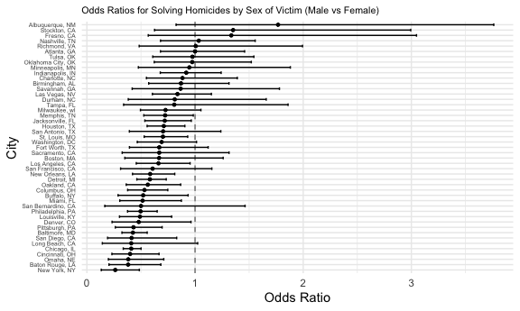

p8105_hw6_ml5218
================
Muying Li
2025-11-26

# Environment Setup

Load necessary packages, set plot theme, set seed

``` r
library(tidyverse)
```

    ## ── Attaching core tidyverse packages ──────────────────────── tidyverse 2.0.0 ──
    ## ✔ dplyr     1.1.4     ✔ readr     2.1.5
    ## ✔ forcats   1.0.0     ✔ stringr   1.5.1
    ## ✔ ggplot2   3.5.2     ✔ tibble    3.3.0
    ## ✔ lubridate 1.9.4     ✔ tidyr     1.3.1
    ## ✔ purrr     1.1.0     
    ## ── Conflicts ────────────────────────────────────────── tidyverse_conflicts() ──
    ## ✖ dplyr::filter() masks stats::filter()
    ## ✖ dplyr::lag()    masks stats::lag()
    ## ℹ Use the conflicted package (<http://conflicted.r-lib.org/>) to force all conflicts to become errors

``` r
library(modelr)
library(mgcv)
```

    ## Loading required package: nlme
    ## 
    ## Attaching package: 'nlme'
    ## 
    ## The following object is masked from 'package:dplyr':
    ## 
    ##     collapse
    ## 
    ## This is mgcv 1.9-3. For overview type 'help("mgcv-package")'.

``` r
set.seed(1)
#library(patchwork)
#library(dplyr)
# library(rvest)
knitr::opts_chunk$set(
  fig.path = "figs/",
  fig.width = 6,
  fig.asp = .6,
  out.width = "90%"
)

theme_set(theme_minimal() + theme(legend.position = "bottom"))

options(
  ggplot2.continuous.colour = "viridis",
  ggplot2.continuous.fill = "viridis"
)

scale_colour_discrete = scale_colour_viridis_d
scale_fill_discrete = scale_fill_viridis_d
```

# Problem 1

Tidy the raw data

``` r
# load data and clean names
homicide_data = read_csv("data/homicide-data.csv") |>
  janitor::clean_names() |> 
  mutate(
    # create a city_state variable (e.g. “Baltimore, MD”) 
    city_state = paste(str_trim(city), str_trim(state), sep = ", "),
    # and a binary variable indicating whether the homicide is solved = closed by arrest (1), otherwise (0)
    status = ifelse(disposition == "Closed by arrest", 1, 0),
    # convert victim_age as numeric
    # noted NA introduced by coercion
    victim_age = as.numeric(victim_age)
  ) |>
  # omit Dallas, TX; Phoenix, AZ; Kansas City, MO; Tulsa, AL 
  filter(
    !city_state %in% c(
      "Dallas, TX",
      "Phoenix, AZ",
      "Kansas City, MO",
      "Tulsa, AL"
    )
  ) |> 
  # limit analysis those for whom victim_race is white or black
  filter(
    victim_race %in% c("White", "Black")
  )
```

    ## Rows: 52179 Columns: 12
    ## ── Column specification ────────────────────────────────────────────────────────
    ## Delimiter: ","
    ## chr (9): uid, victim_last, victim_first, victim_race, victim_age, victim_sex...
    ## dbl (3): reported_date, lat, lon
    ## 
    ## ℹ Use `spec()` to retrieve the full column specification for this data.
    ## ℹ Specify the column types or set `show_col_types = FALSE` to quiet this message.

    ## Warning: There was 1 warning in `mutate()`.
    ## ℹ In argument: `victim_age = as.numeric(victim_age)`.
    ## Caused by warning:
    ## ! NAs introduced by coercion

Take a quick look on the data

``` r
homicide_data |> 
  count(victim_sex, victim_race)
```

    ## # A tibble: 6 × 3
    ##   victim_sex victim_race     n
    ##   <chr>      <chr>       <int>
    ## 1 Female     Black        4066
    ## 2 Female     White        1837
    ## 3 Male       Black       29256
    ## 4 Male       White        4493
    ## 5 Unknown    Black          39
    ## 6 Unknown    White           2

Noted `victim_sex` has unknown values. Remove it.

``` r
homicide_data = homicide_data |> 
  filter(
    victim_sex != "Unknown"
  )
```

Take a quick look on the data again to ensure the quality

``` r
homicide_data |> 
  count(victim_sex, victim_race)
```

    ## # A tibble: 4 × 3
    ##   victim_sex victim_race     n
    ##   <chr>      <chr>       <int>
    ## 1 Female     Black        4066
    ## 2 Female     White        1837
    ## 3 Male       Black       29256
    ## 4 Male       White        4493

## Fit a logistic regression for the city of Baltimore, MD using the `glm`

``` r
# save the output of `glm` as an R object
baltimore_glm_results = 
  homicide_data |> 
  filter(
    city_state == "Baltimore, MD"
  ) |> 
  # glm will auto remove rows w/ NA values
  # fit a logistic regression with resolved vs unresolved as the outcome and victim age, sex and race as predictors 
  glm(status ~ victim_age + victim_sex + victim_race, data = _, family = binomial) 

# apply the broom::tidy to this object
fit_baltimore = baltimore_glm_results |> 
  # obtain the estimate and confidence interval of the adjusted odds ratio
  broom::tidy(exponentiate = TRUE, conf.int = TRUE)

# OR for solving homicides comparing male victims to female victims keeping all other variables fixed.
fit_baltimore |> 
  filter(grepl("victim_sex", term)) |> 
  select(term, estimate, conf.low, conf.high, p.value)
```

    ## # A tibble: 1 × 5
    ##   term           estimate conf.low conf.high  p.value
    ##   <chr>             <dbl>    <dbl>     <dbl>    <dbl>
    ## 1 victim_sexMale    0.426    0.324     0.558 6.26e-10

Interpretation: After adjusting for victim age and race, the odds of a
homicide being resolved are about 57% lower when the victim is male than
when the victim is female.

## Run `glm` for every city

``` r
# wrap it into a function
fit_city_model <- function(df) {
  glm_results = glm(status ~ victim_age + victim_sex + victim_race, data = df, family = binomial) 
  glm_results |> 
    broom::tidy(exponentiate = TRUE, conf.int = TRUE) |> 
    filter(grepl("victim_sex", term)) |> 
    select(term, estimate, conf.low, conf.high, p.value)
}
```

Run `glm` for all cities

``` r
all_city_glm_results = homicide_data |> 
  group_by(city_state) |> 
  nest() |> 
  mutate(fit_results = map(data, fit_city_model)) |>
  unnest(fit_results)
```

Plotting

``` r
all_city_glm_results |> 
  ggplot(aes(x = estimate, y = fct_reorder(city_state, estimate)))+
  geom_vline(xintercept = 1, linetype = "dashed", color = "gray50") +
  geom_point(size = 1)+
  geom_errorbarh(
    aes(xmin = conf.low, xmax = conf.high),
    height = 0.5
  ) +                           
  labs(
    title = "Odds Ratios for Solving Homicides by Sex of Victim (Male vs Female)",
    x = "City",
    y = "Odds Ratio",
  ) +
  theme(
    plot.title = element_text(size = 8),
    axis.text.y = element_text(size = 5)
  )
```



# Problem 2

Load data

``` r
library(p8105.datasets)
data("weather_df")
```

## Simple linear regression with tmax as the response with `tmin` and `prcp` as the predictors
